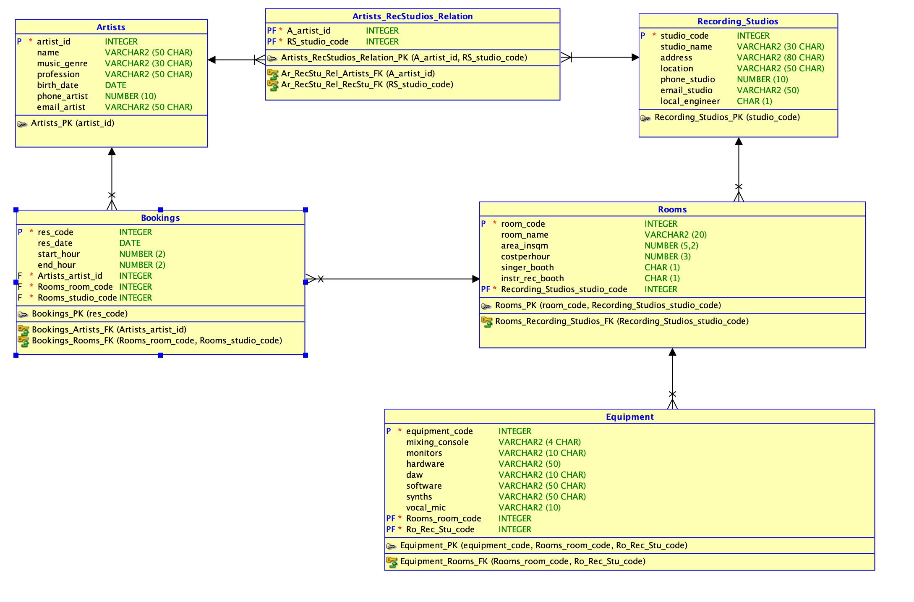

Milestone 2: Modellering
---
TOP DOWN MODELERING
---

Conceptueel Model
---

    Entiteittypes + Attributen + PK
---
- Artist ( **artist_id**, name, music_genre, profession, birth_date, phone_artist, email_artist)
- Booking (**res_code**, res_date, start_hour, end_hour, artist_id, room_code, studio_code)
- Recording Studio ( **studio_code**, studio_name, address, location, phone_studio, email_studio, local_engineer)
- Room (**room_code**, room_name, area_insqm, costperhour, singer_booth, instr_rec_booth, studio_code)
- Equipment (**equipment_code**, mixing_console, monitors, hardware, daw, software, synths, vocal_mic, room_code, studio_code)

    Domeinen - constraints
--- 
- Bookings: end hour > start hour
- Artists: music genre - minimum 3 characters
- Artists: email_artist - must contain @
- Recording_Studios: email_studio - must contain @
- Recording_Studios: location - uppercase
- Rooms: area_insqm - max 500
- Rooms: costperhour - max 200

    Tijd 
---
- Artist: birth_date
- Booking: the date on which a room of the recording studio will be used: res_date 
- Player: duration of the booking: start_hour, end_hour

    Conceptueel ERD
---

Logisch Model
---

    Intermediërende  entiteiten
---
- Bookings: Artists - Recording Studios

    Logisch ERD
---

Verschillen na Normalisatie
---
- Extra entiteit: Zipcodes
- Extra entities: Countries
- Tabel player_locations heeft gewijzigde samengestelde sleutel omdat je als speler bijvoorbeeld verschillende huureigendommen kunt hebben.
  - PK: (Player_id, location_id, startdatum)

