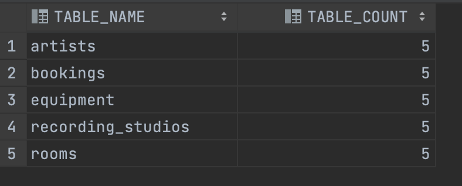
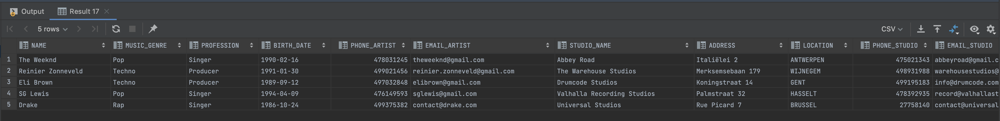
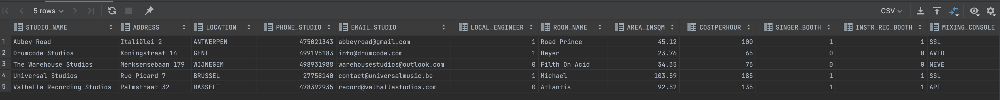
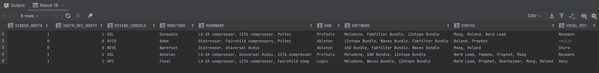
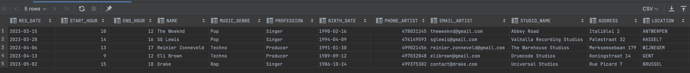
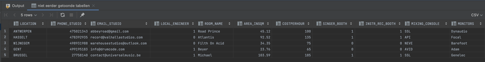
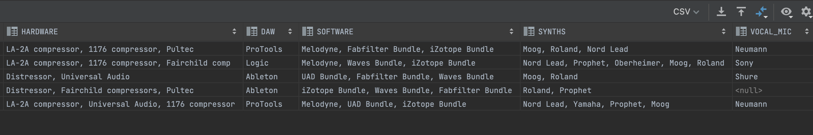

Milestone 3: Creatie Databank
---

    Identity columns
---
- Mandatory
  - Artists: artist_id
  - Recording_Studios: studio_code
  - Rooms: room_code
  - Equipment: equipment_code
- other:
  - Bookings: res_code

      Table Counts
---

    @query 1: Relatie Veel-op-veel

    SELECT name,MUSIC_GENRE, PROFESSION, BIRTH_DATE, PHONE_ARTIST, EMAIL_ARTIST, STUDIO_NAME, ADDRESS, LOCATION, PHONE_STUDIO, EMAIL_STUDIO,LOCAL_ENGINEER 
    FROM ARTISTS a 
    JOIN ARTISTS_RECSTUDIOS_RELATION ar ON ar.A_ARTIST_ID = a.ARTIST_ID 
    JOIN RECORDING_STUDIOS r ON r.STUDIO_CODE = ar.RS_STUDIO_CODE;
--- 

    @query 2: 2 niveau’s diep

    SELECT STUDIO_NAME, ADDRESS, LOCATION, PHONE_STUDIO, EMAIL_STUDIO, LOCAL_ENGINEER, ROOM_NAME, AREA_INSQM, COSTPERHOUR, SINGER_BOOTH, INSTR_REC_BOOTH, MIXING_CONSOLE, MONITORS, HARDWARE, DAW, SOFTWARE, SYNTHS, VOCAL_MIC
    FROM RECORDING_STUDIOS r
    JOIN ROOMS ro ON ro.RECORDING_STUDIOS_STUDIO_CODE = r.STUDIO_CODE
    JOIN EQUIPMENT e ON e.ROOMS_ROOM_CODE = ro.ROOM_CODE
    ORDER BY STUDIO_NAME, ROOM_NAME, EQUIPMENT_CODE;
--- 

    @query 3: bookings

    SELECT RES_DATE, START_HOUR, END_HOUR, NAME, MUSIC_GENRE, PROFESSION, BIRTH_DATE, PHONE_ARTIST, EMAIL_ARTIST, STUDIO_NAME, ADDRESS, LOCATION, PHONE_STUDIO, EMAIL_STUDIO, LOCAL_ENGINEER, ROOM_NAME, AREA_INSQM, COSTPERHOUR, SINGER_BOOTH, INSTR_REC_BOOTH,MIXING_CONSOLE,MONITORS, HARDWARE, DAW, SOFTWARE, SYNTHS,  VOCAL_MIC
    FROM BOOKINGS b
    JOIN ARTISTS a ON a.ARTIST_ID = b.ARTISTS_ARTIST_ID
    JOIN RECORDING_STUDIOS r ON r.STUDIO_CODE = b.ROOMS_STUDIO_CODE
    JOIN ROOMS ro ON b.ROOMS_ROOM_CODE = ro.ROOM_CODE
    JOIN EQUIPMENT e ON e.ROOMS_ROOM_CODE = b.ROOMS_ROOM_CODE AND e.RO_REC_STU_CODE = b.ROOMS_STUDIO_CODE
    ORDER BY RES_DATE, NAME, STUDIO_NAME, ROOM_NAME;
--- 

  Bewijs Domeinen - constraints M2
--- 
    Bookings: end hour > start hour

---

    Artists: music genre - minimum 3 characters

---

    Artists: email_artist - must contain @

---

    Recording_Studios: email_studio - must contain @

---

    Recording_Studios: location - uppercase

---

    Rooms: area_insqm - max 500

---

    Rooms: costperhour - max 200

---

